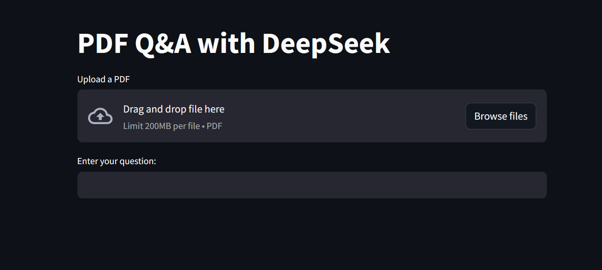

# PDF Q&A with DeepSeek

This is a Streamlit application that enables users to upload a PDF document and ask natural language questions based on its content. It uses:
- `PyMuPDF` for loading PDFs
- `LangChain` for document chunking and embedding
- `Chroma` as a vectorstore
- `DeepSeek` (via OpenAI-compatible API) to answer questions using LLMs

## 🖼️ App Preview

Here’s what the app looks like in action:




## 🚀 How to Run

1. Clone the repository:
```bash
git clone https://github.com/yourusername/pdf-qa-app.git
cd pdf-qa-app
```

2. Set up a `.env` file with your DeepSeek API key:
```env
DEEPSEEK_API_KEY=your_api_key_here
```

3. Install dependencies:
```bash
pip install -r requirements.txt
```

4. Run the app:
```bash
streamlit run pdf_QA_cleaned.py
```

## 📁 Files

- `ask_pdf.py`: The main Streamlit app
- `requirements.txt`: Dependencies list
- `.env`: Contains your DeepSeek API key (not included, you must create it)

## 🧠 Model
Uses `deepseek-reasoner` via OpenAI-compatible API with base_url `https://api.deepseek.com`.

---

Made with ❤️ using Streamlit and LangChain.
